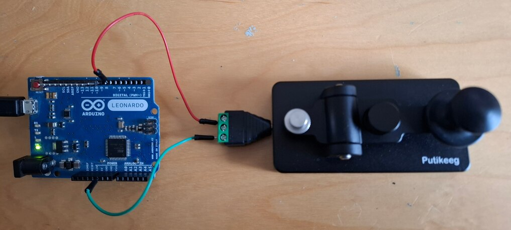

# Response key for human psychology experiments

`Time-stamp: <2024-12-09 16:28:19 christophe@pallier.org>`

In human experimental psychology, many experiments require the recording of reaction-times. Although the keyboard or the mouse buttons can be used to record manual responses, they can potentially introduce non-negligeable measurement errors ([refs](#refs))
 
The picture below shows a simple response key device based on an [Arduino Leornardo](https://docs.arduino.cc/hardware/leonardo/) microcontroller and a [Morse key](https://putikeeg.com/products/straight-key-morse).

Pressing the response key closes the circuit betwen ground (`GND`) and `pin 2` (through cables connected to a [male jack to terminal block adapter](https://www.amazon.fr/Poppstar-connecteurs-Audio-connecteur-Broches/dp/B07XDMB4LR/).

The Leonardo, attached on a USB port of the computer, behaves as a keyboard: each time the Morse key is pressed, a character `f` is sent.

To address the issue of [debouncing](https://www.ganssle.com/debouncing.htm) , I used a [Schmitt trigger algorithm](documents/pdfs/Mazzocca - 2004 - Contact-debouncing algorithm emulates Schmitt trigger.pdf) 

The arduino sketch is available [here](response_key_leonardo_HIGHLOW/response_key_leonardo_HIGHLOW.ino)

You can compile and upload this sketch to the Leonardo using the [arduino software](https://www.arduino.cc/en/software) (Do not forget to select `Tools -> Board -> Leonardo` and the serial port address corresponding the the Leonardo (listed in devices))

## Limitations

* The device is seen as a keyboard. Therefore all delays due to the OS, the HID driver, the scanning of the USB port, remain present. One solution would be to measure the reaction time within the Arduino itself, and then sent it to the PC upon request (which requires to implement a dialog between the PC and the Arduino). 
* The code detects the key press, but not the key release.  So with the code above, it is not possible to measure the duration of a press.  Also, note that the arduino leonardo `keyboard.write` function immediately emits a keyup event after the keypress one. 

* The code only works for one response key (but could be modified to handle several keys)
* The threshold values and delay for the schmitt triggger algorithm may need to be tunes to the response key.

<a name="refs">References</a>

* Plant, Richard R., Nick Hammond, and Tom Whitehouse. 2003. “How Choice of Mouse May Affect Response Timing in Psychological Studies.” Behav Res Methods Instrum Comput 35 (2): 276–84.
* Shimizu, Hidemi. 2002. “Measuring Keyboard Response Delays by Comparing Keyboard and Joystick Inputs.” _Behavior Research Methods, Instruments, & Computers_ 34 (2): 250–56. https://doi.org/10.3758/BF03195452.
* Elegant debouncing solution with software Schmitt trigger <https://forum.arduino.cc/t/elegant-debouncing-solution-with-software-schmitt-trigger-emulation/122724>

